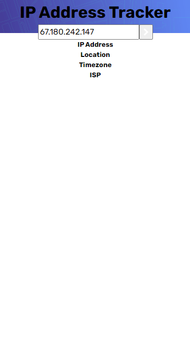

# Table of contents

- [Overview](#overview)
  - [Skills](#skills)
  - [Links](#links)
  - [Author](#author)
  - [The Challenge](#the-challenge)
- [Screenshot](#screenshot)
- [What I learned](#what-i-learned)

## Overview

### Skills

- Semantic HTML5 markup
- Sass Preprocessor
- Flexbox
- Mobile-first workflow
- JS Fetch() API
- DotEnv
- Parcel JS Module Bundler
- RESTful API usage
  - [IP Geolocation API by IPify](https://geo.ipify.org/)
  - [LeafletJS](https://leafletjs.com/)
- Netlify for deployment

### Links

- Solution URL: [Add solution URL here](https://your-solution-url.com)
- Live Site URL: [Add live site URL here](https://your-live-site-url.com)

### Author

- Website - [Jaytee Padilla](https://jayteepadilla.dev/)

### The Challenge

Users should be able to:

- IMPORTANT NOTE: The free tier of the IP Geolocation API is limited to 1000 credits (a.k.a requests). If the API is no longer loading content properly, it's more than likely because the free credits have run dry
- See their own IP address on the map on the initial page load
- Search for any IP addresses or domains and see the key information and location
- View the optimal layout for each page depending on their device's screen size
- See hover states for all interactive elements on the page

### Screenshot


## What I Learned

- Basics of what module bundlers can do (specifically `Webpack` & `Parcel`). `required()` & `import` don't work in a vanilla JS client side app & module bundlers can enable that functionality. For the sake of simplicity, I chose Parcel JS because it's the easiest & fastest to setup despite Webpack being the most common bundler seen out in the wild
  - On top of enabling the ability to `import` modules, module bundlers also compile SASS/SCSS code without the need of having to write a script to do it (e.g. `"watch-sass": "sass --no-source-map -w styles/scss/main.scss styles/css/main.css"`)
  - [This video](https://youtu.be/R02ehdTzi3I) & [this article](https://codeburst.io/bundle-your-web-application-with-parceljs-b4eee99bdb55) helped me get started with implementing Parcel
- AdBlock extensions can sometimes block API requests 😅
- When trying to apply the top background image to the UI, I originally tried something like this in the `body` CSS, but it made the image height inconsistent when shrinking/enlarging the viewport size
```scss
body {
  font-family: 'Rubik', sans-serif;
  background-image: url('/images/pattern-bg.png');
  background-repeat: no-repeat;
  background-size: 100% auto;
}
```
<p align='center'>
  
</p>

- Adding a `div` around the main content of the page and applying a `background-image` property to that helped ensure a consistent size that's also responsive
```scss
body {
  font-family: 'Rubik', sans-serif;

  .container {
    .bg-banner {
      background-image: url('/images/pattern-bg.png');
      background-repeat: no-repeat;
      background-size: cover;
      height: 35vh;
    }
  }
}
```
<p align='center'>
  
</p>

- Combining multiple javascript files into one file (with the help of a bundler) is more efficient than using multiple `<script>` tags. The server is pinged each time per script tag, so less script tags = less calls to server 👍

- A `placeholder` attribute should not be used as an alternative to a label. The placeholder is a short hint intended to aid the user with data entry so it should not be identical to the label element. The placeholder may not be available to assistive technology and thus may not be relied upon to convey an accessible name or description -- it acts similar to fallback content


To see how you can add code snippets, see below:

```html
<h1>Some HTML code I'm proud of</h1>
```
```css
.proud-of-this-css {
  color: papayawhip;
}
```
```js
const proudOfThisFunc = () => {
  console.log('🎉')
}
```
